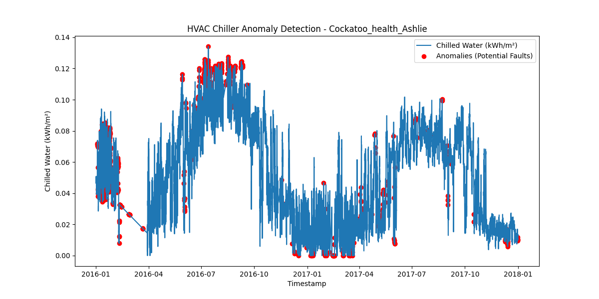
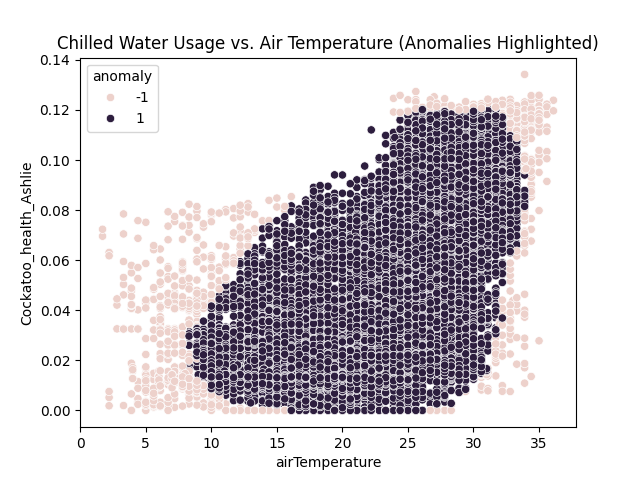
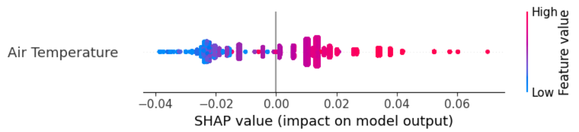
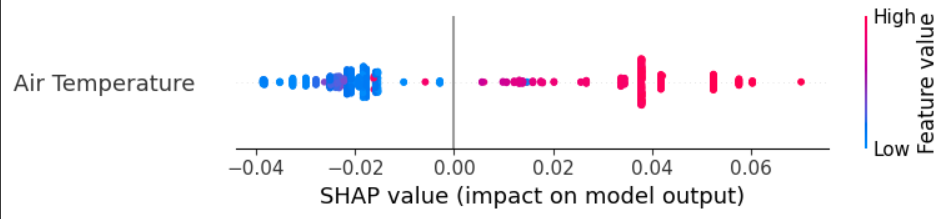

# HVAC Fault and Anomaly Detection
A machine learning-based approach to detect anomalies in HVAC chiller systems using the Building Data Genome Project 2 dataset. This project identifies potential equipment faults and inefficiencies in commercial building cooling systems.

## 🎯 Project Overview
This project analyzes chilled water consumption patterns in commercial buildings to detect anomalies that may indicate:
- Equipment malfunctions
- System inefficiencies  
- Maintenance needs
- Unusual operating conditions

## 📊 Dataset
**Source**: [Building Data Genome Project 2](https://www.kaggle.com/datasets/claytonmiller/buildingdatagenomeproject2) on Kaggle

The dataset includes:
- Chilled water consumption data from multiple buildings
- Weather data (air temperature, humidity, etc.)
- Building metadata (size, location, type)
- Hot water consumption data

## 🔧 Features
- **Data Preprocessing**: Handles missing values and normalizes consumption by building size
- **Anomaly Detection**: Uses Isolation Forest algorithm to identify unusual patterns
- **Explainable AI**: SHAP (SHapley Additive exPlanations) values for model interpretability
- **Heuristic Rules**: Statistical thresholds for additional fault detection
- **Visualization**: Multiple plots showing anomalies and their relationships with weather

## 🚀 Getting Started

### Prerequisites
```bash
pip install kagglehub pandas numpy matplotlib seaborn scikit-learn shap
```

### Installation
1. Clone the repository:
```bash
git clone https://github.com/Hrita0910/Fault_Detection_HVAC.git
cd Fault_Detection_HVAC
```
2. Run the main script:
```bash
jupyter notebook Fault_Detection.ipynb
```

## 📁 Project Structure
```
hvac-anomaly-detection/
│
├── Fault_Detection.ipynb          # Main Colab notebook
├── README.md                       # This file
├── requirements.txt                # Python dependencies
│
├── outputs/                        # Results and plots
    ├── anomaly_plot.png
    ├── shap_summary.png
    ├── shap_anomalies.png
    ├── anomaly_analysis.png
    ├── chiller_anomalies.csv
    └── heuristic_triggers.csv
```

## 🔬 Methodology

### 1. Data Preprocessing
- Filter buildings with <50% missing data
- Interpolate missing values using time-based methods
- Normalize consumption by building floor area (kWh/m²)
- Merge with weather data for correlation analysis

### 2. Anomaly Detection
- **Isolation Forest**: Unsupervised algorithm that isolates anomalies
- **Contamination Rate**: Set to 5% (configurable)
- **Features**: Chilled water consumption + air temperature

### 3. Explainability
- **SHAP Values**: Explain why certain points are flagged as anomalies
- **Feature Importance**: Understand the role of temperature in predictions

### 4. Heuristic Rules
- Statistical threshold: Mean + 2 standard deviations
- Identifies periods of unusually high consumption

## 📈 Results

### Example Building: Cockatoo_health_Ashlie

- **Anomaly Rate**: ~5% of data points flagged
- **Peak Anomalies**: Concentrated during summer months (high cooling demand)
- **Key Insights**: 
  - Most anomalies occur at moderate temperatures (20-30°C)
  - Some anomalies during low-temperature periods may indicate system faults

### Visualizations Generated

#### 1. Time Series Anomaly Detection
This plot shows the chilled water consumption over time with detected anomalies highlighted in red:



*The time series reveals seasonal patterns and successfully identifies anomalous consumption periods that don't follow expected patterns.*

#### 2. Temperature vs. Consumption Analysis
Scatter plot showing the relationship between air temperature and chilled water consumption:



*Most normal operations follow a clear temperature-consumption relationship, while anomalies (shown in pink) often deviate from this expected pattern.*

#### 3. Model Explainability - SHAP Summary (All Data)
SHAP values explaining the overall model behavior:



*This plot shows how air temperature influences the model's predictions across the entire dataset.*

#### 4. Model Explainability - SHAP for Anomalies
SHAP values specifically for detected anomalies:




## 📊 Key Findings

- **Temperature Independence**: Anomalies are not always correlated with extreme temperatures
- **Equipment Issues**: Some high-consumption periods during mild weather suggest equipment malfunctions
- **Dual Detection**: The model successfully identifies both demand-driven and fault-related anomalies
- **Seasonal Patterns**: Summer months show higher anomaly rates due to increased cooling demands
- **Maintenance Indicators**: Low-temperature anomalies often indicate potential system faults requiring attention

## 💡 Practical Applications

This system can be used for:
- **Predictive Maintenance**: Early detection of equipment failures
- **Energy Optimization**: Identifying inefficient operation periods
- **Cost Reduction**: Preventing major equipment failures through early intervention
- **Performance Monitoring**: Continuous assessment of HVAC system efficiency
